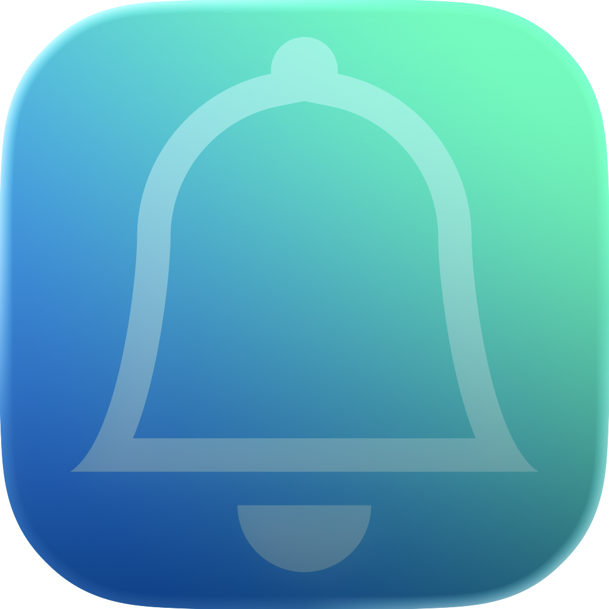

<p align="center">
    
</p>

<h1 align="center">
    Alertsy
</h1>

<p align="center">
    Alertsy is a SwiftUI package for presenting customizable alerts in your apps with a simple, modern API. Built with support for Swift 6!
    <br>
    <br>
    <a href="https://swift.org">
        
    </a>
    <a href="https://www.apple.com/ios/">
        
    </a>
    <a href="https://www.apple.com/macOS/">
        
    </a>
    <a href="https://www.apple.com/tvOS/">
        
    </a>
</p>

## Features

- Present alerts with options for titles, messages, and multiple actions
- Support for default, cancel, and destructive button styles
- Beyond easy integration with SwiftUI environment
- Observable alert manager for programmatic control

## Installation
<b>Xcode Method:</b><br>
Go to `File` -> `Add Packages` and enter:
`https://github.com/bentheminernz/Alertsy.git`
<br><br>

<b>Or add Alertsy to your `Package.swift`:</b>
```swift
.package(url: "https://github.com/bentheminernz/Alertsy.git", from: "1.0.0")
```
## Usage

### 1. Add `.alertsy` to your apps `@main` entry
Adding Alertsy to your app is super simple and only takes 2 lines!
```swift
import SwiftUI
import Alertsy

@main
struct MyApp: App {
    var body: some Scene {
        WindowGroup {
            ContentView()
                .alertsy()
        }
    }
}
```

### 2. Present an Alert!
Presenting an alert with Alertsy is super easy! It comes with some easy convience methods to show certain types of alerts.

```swift
import SwiftUI
import Alertsy

struct ContentView: View {
    @Environment(\.alertsy) private var alertsy

    var body: some View {
        VStack {
            Button("Success") {
                alertsy.showSuccess("Success")
            }

            Button("Error") {
                alertsy.showError("An error occurred")
            }

            Button("Confirmation") {
                alertsy.showConfirmation(
                    title: "Confirm Action",
                    message: "Are you sure you want to proceed?",
                    confirmTitle: "Yes",
                    cancelTitle: "No",
                    onConfirm: {
                        // Action goes here!
                    }
                )
            }

            Button("Show Destructive Confirmation") {
                alertsy.showConfirmation(
                    title: "Delete Item",
                    message: "Are you sure you want to delete this item?",
                    confirmTitle: "Delete",
                    cancelTitle: "Cancel",
                    onConfirm: {
                        // Action goes here!
                    }
                )
            }
        }
    }
}
```

### Custom Alert Configurations
Alertsy also lets you use the `alertsy.show` to show an alert with custom `AlertAction`'s
```swift
Button("Show Alert with Custom Actions") {
    alertsy.show(
        title: "Custom Alert",
        message: "This is a custom alert with actions.",
        primaryAction: AlertAction(
            title: "Primary Action",
            style: .default,
            action: {
                // Primary action goes here!
            }
        ),
        secondaryAction: AlertAction(
            title: "Secondary Action",
            style: .cancel,
            action: {
                // Secondary action goes here!
            }
        )
    )
}
```

### Confirmation Dialogs
Alertsy now supports SwiftUI confirmation dialogs (action sheets) for more flexible action presentation!

```swift
Button("Show Confirmation Dialog") {
    alertsy.showConfirmationDialog(
        title: "Choose Action",
        message: "What would you like to do?",
        confirmTitle: "Confirm",
        cancelTitle: "Cancel",
        onConfirm: {
            // Confirmation action goes here!
        }
    )
}

Button("Show Destructive Confirmation Dialog") {
    alertsy.showDestructiveConfirmationDialog(
        title: "Delete Item",
        message: "This action cannot be undone.",
        destructiveTitle: "Delete",
        cancelTitle: "Cancel",
        onConfirm: {
            // Destructive action goes here!
        }
    )
}

Button("Show Multiple Action Confirmation Dialog") {
    alertsy.showConfirmationDialog(
        title: "Choose Option",
        message: "Select from multiple actions:",
        actions: [
            AlertAction(title: "Option 1", style: .default) {
                // Option 1 action
            },
            AlertAction(title: "Option 2", style: .default) {
                // Option 2 action
            },
            AlertAction(title: "Delete", style: .destructive) {
                // Destructive action
            },
            AlertAction(title: "Cancel", style: .cancel) {
                // Cancel action
            }
        ]
    )
}
```

## API Reference

- **AlertManager**  
  The brains behind Alertsy! An observable class you use to show alerts and confirmation dialogs programmatically.  
  Comes with handy methods like `show`, `showSuccess`, `showError`, `showConfirmation`, `showConfirmationDialog`, and `showDestructiveConfirmationDialog`.

- **AlertModels**  
  The core models that power your alerts:
  - `AlertConfiguration`: Holds the alert’s title, message, and actions.
  - `AlertAction`: Represents a button in your alert, with style and an action closure.

- **AlertPresenter**  
  Handles the logic for actually displaying alerts and confirmation dialogs in your SwiftUI views.

- **Alertsy**  
  The SwiftUI environment integration.  
  Just use the `.alertsy()` view modifier and `@Environment(\.alertsy)` to get access to the alert manager anywhere in your views.

## License

Alertsy is available under the MIT License!

---

Made with 💛 by me!